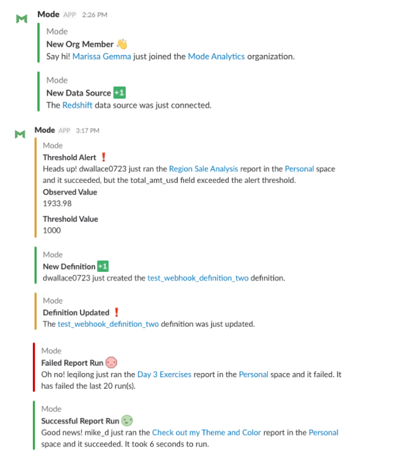

<p align="center">
  
</p>

----

# webhooks-playbook
Reusable and customizable code examples for how to utilize Mode webhooks.


## Payload Enrichment

The [hookrich](https://github.com/mode/webhooks-playbook/blob/master/examples/enrichment/hookrich.py) module acts as an intermediate enrichment layer. It takes the content of a Mode webhook as inputs. For Example, a webhook for a Report Run Completed event:

```
{
  "event": "report_run_completed",
  "report_run_url": "https://modeanalytics.com/api/ORG/reports/REPORT_TOKEN/runs/REPORT_RUN_TOKEN"
}
```

and returns a dictionary with supplemental information about the event:

```
{
  "report_run": {
    "id": report_run_id,
    "token": report_run_token,
    "created_at": report__run_created_at,
    "state": report_run_state,
    "results": []
    ...
  },
  "report": {
    "name": report_name,
    "id": report_id,
    "created_at": report_created_at,
    "token": report_token,
    "url": report_url,
    ...
  },
  "space": {
    "name": space_name,
    "id": space_id,
    "token": space_token,
    "url": space_url,
    ...
  }
}
```

This result can then be used as the payload in a POST request. A library such as the [requests](http://docs.python-requests.org/en/master/) python library will automatically form-encode the dictionary when the request is made.

----

## Actions

The following examples are meant to serve as inspiration for building workflows using webhooks. The following examples are built to run on [AWS Lambda](https://aws.amazon.com/lambda/) and are triggered by an outgoing Mode webhook.

### `post_to_destination` [(source)](https://github.com/mode/webhooks-playbook/blob/master/examples/aws_lambda/post_to_destination.py)

This module uses the output of the [`hookrich`](https://github.com/mode/webhooks-playbook/blob/master/examples/enrichment/hookrich.py) module and POSTs it to the specified destination URL. This destination could be a service such as Zapier, Slack, etc.

### `post_to_slack` [(source)](https://github.com/mode/webhooks-playbook/blob/master/examples/aws_lambda/post_to_slack.py)

This module uses the output of the [`hookrich`](https://github.com/mode/webhooks-playbook/blob/master/examples/enrichment/hookrich.py)  module to contextually create a Slack message depending on the event. This module also can be customized to send alerts based on query results.

Example output can be viewed below:



### `log_usage_csv` [(source)](https://github.com/mode/webhooks-playbook/blob/master/examples/aws_lambda/log_usage_csv.py)

This module uses Mode webhooks to log your organizations usage of Mode to a csv file.

----

## Preparing Code for AWS Lambda

The easiest way to utilize this code in AWS lambda is to create a [deployment package](http://docs.aws.amazon.com/lambda/latest/dg/lambda-python-how-to-create-deployment-package.html). The following steps serve as an example of how to go about creating a deployment package for the [`post_to_slack`](examples/aws_lambda/post_to_slack.py) module.

```
cd ~
mkdir lambda-slack-deployment
cp ~/path-to/repo/examples/enrichment/hookrich.py ~/lambda-slack-deployment/
cp ~/path-to/repo/examples/aws_lambda/post_to_slack.py ~/lambda-slack-deployment/
pip install requests -t ~/lambda-slack-deployment
```

Once you have all the necessary files in the deployment package directory, you need to zip the contents of the directory. Once you have a `.zip` file containing all of the necessary code for the Lambda function, you can upload this file in the Lambda console.
